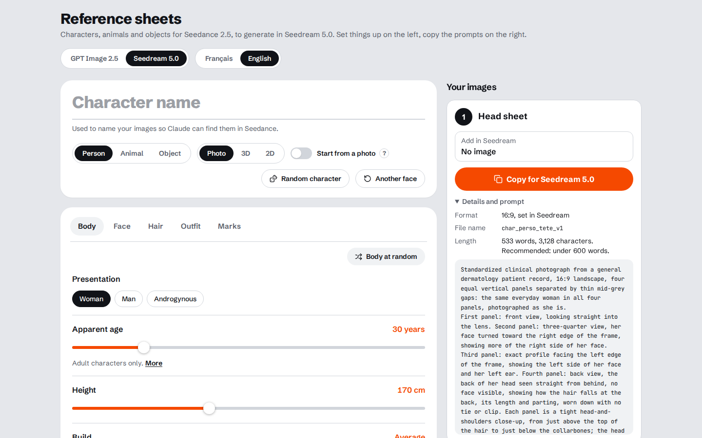

# Seedance Reference Sheets

**Stop your AI characters from changing faces between shots.**

Build clean, consistent reference sheets for people, animals and objects, then hand them to Seedance 2.5 so every clip starts from the same identity.

**[Open the app](https://mmmprod-org.github.io/seedance-reference-sheets/)** · [Download a version](https://github.com/MMMProd-Org/seedance-reference-sheets/releases) · [Report an issue](https://github.com/MMMProd-Org/seedance-reference-sheets/issues/new/choose) · [How it's built](docs/BUILD.md)

Each release is the whole app as one HTML file, so any version can be kept and opened offline; the app shows its version in the header.

## The problem

Text prompts drift. Ask a video model for "a woman in a red coat" five times and you get five different women.
Seedance 2.5 can hold a character steady from reference images, but only if the references are clean:
the same light, a neutral backdrop, matching angles, nothing invented from one view to the next.
Writing the prompts that produce sheets like that, one by one, is where the hours go.

## What this does

You describe the subject with controls instead of prose. The app writes the prompt that turns GPT Image 2.5 or Seedream 5.0 into a reference-sheet generator:
a plain grey studio, matched views of the same subject, no text, no mirrored sides.
Paste the prompt, generate the sheet, drop it into Seedance as a reference.

No install. No account. No API key. It is a single web page.

## How it works

1. **Set it up.** Pick Person, Animal or Object. Adjust face, body, hair, outfit and marks, or leave them on Auto. Hit *Random character* to start from a fresh face.
2. **Copy the prompt.** Each card says which image model it is for and which images to attach.
3. **Generate and reuse.** Make the sheet in your image tool, then add it to Seedance 2.5 as a reference. The suggested file names keep every sheet easy to find.

## What's inside

- **One role per image.** For a person, a head sheet for the face and a body sheet for the body. For an animal, one sheet of the whole animal, with optional head close-ups made from it. For an object or a place, one image per view; an object can also have its three views side by side in one image (a triptych), instead of the separate views. Each reference does one job.
- **People, animals, objects and places.** Vehicles on their wheels, clothing on an invisible mannequin (laid flat for its optional third view; a garment kept exactly as in your photo goes on it only if you tick the option), products shot on their own, and location views of a house exterior or an interior, by day and by night.
- **Fine control where it matters.** Age shown through visible signs, facial structure, skin realism, separate sliders for muscle volume and definition, outfits with wear and dirt, scars and marks pinned to a side and a spot.
- **Edits without drift.** Retouch an approved sheet, dress a body sheet, add the heads, while the proportions stay put.
- **A cast, not just a character.** Name several characters in one GPT Image conversation. Each prompt points to its own character and keeps the others out.
- **Two image models.** Prompts written for GPT Image 2.5 or Seedream 5.0, with a length counter that warns you when a prompt gets long enough for the model to skip parts of it.
- **English or French interface.**
- **Private by design.** Everything runs in your browser. There is no backend, and your settings stay in your browser's local storage. The only outside request is for the fonts.

## Supported models

| Step | Model | Coverage |
| --- | --- | --- |
| Reference sheets | GPT Image 2.5 | People, animals, objects, places |
| Reference sheets | Seedream 5.0 | People (photo style), animals, objects, places |
| Video | Seedance 2.5 | Uses the sheets as image references |

## FAQ

**Does it generate the images?**
No. It writes the prompts. You generate the sheets in GPT Image 2.5 or Seedream 5.0 with your own account.

**Will Seedance accept my sheets?**
That depends on where you run Seedance. Some services restrict reference images that show realistic human faces. Check your platform's rules. If a model update breaks your results, open a *Model compatibility* issue.

## Responsible use

Use photos of real people only with their consent.
Do not use this tool to make sexual, deceptive or harassing content about real people.
Follow the rules of OpenAI, ByteDance and every platform you generate on.

## Issues and feedback

- [Bug report](https://github.com/MMMProd-Org/seedance-reference-sheets/issues/new?template=bug_report.yml): something in the app is broken.
- [Model compatibility](https://github.com/MMMProd-Org/seedance-reference-sheets/issues/new?template=model_compat.yml): a model update changed the results, or a prompt is now refused. Models change often, and these reports are what keep the prompts current.
- [Feature request](https://github.com/MMMProd-Org/seedance-reference-sheets/issues/new?template=feature_request.yml): a new kind of sheet or control.

## Build it yourself

One Python 3 command, no dependencies. See [docs/BUILD.md](docs/BUILD.md).

## License

[PolyForm Noncommercial 1.0.0](LICENSE): free for personal, research and other noncommercial use.
For commercial use, open an issue to ask about a license.

Seedance and Seedream are trademarks of ByteDance. GPT Image is a trademark of OpenAI.
This project is independent and is not affiliated with or endorsed by either company.
